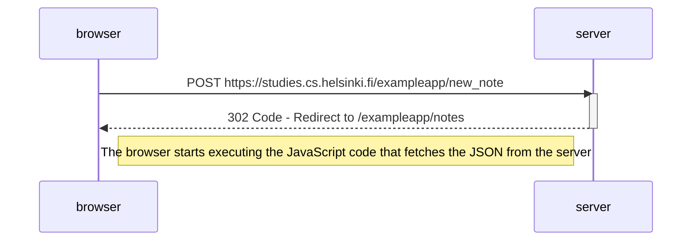

```mermaid
sequenceDiagram
    participant browser
    participant server

    browser->>server: POST https://studies.cs.helsinki.fi/exampleapp/new_note
    activate server
    server-->>browser: 302 Code - Redirect to /exampleapp/notes
    deactivate server


    Note right of browser: The browser starts executing the JavaScript code that fetches the JSON from the server
```

