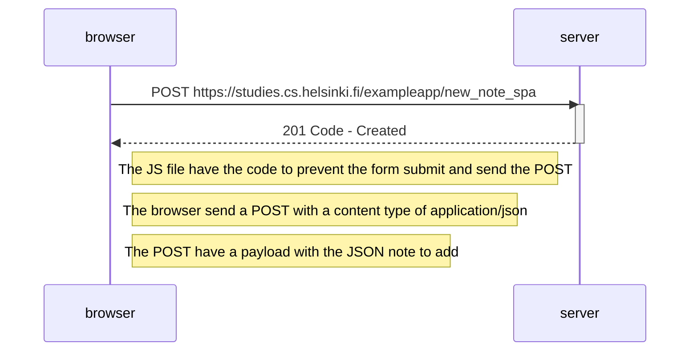

```mermaid
sequenceDiagram
    participant browser
    participant server

    browser->>server: POST https://studies.cs.helsinki.fi/exampleapp/new_note_spa
    activate server
    server-->>browser: 201 Code - Created
    deactivate server

    Note right of browser: The JS file have the code to prevent the form submit and send the POST
    Note right of browser: The browser send a POST with a content type of application/json
    Note right of browser: The POST have a payload with the JSON note to add

```

